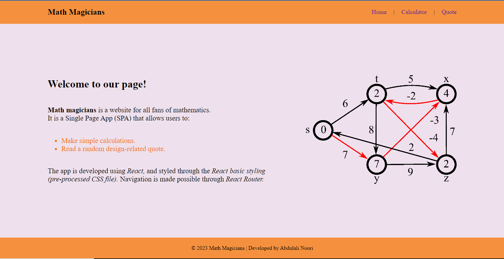
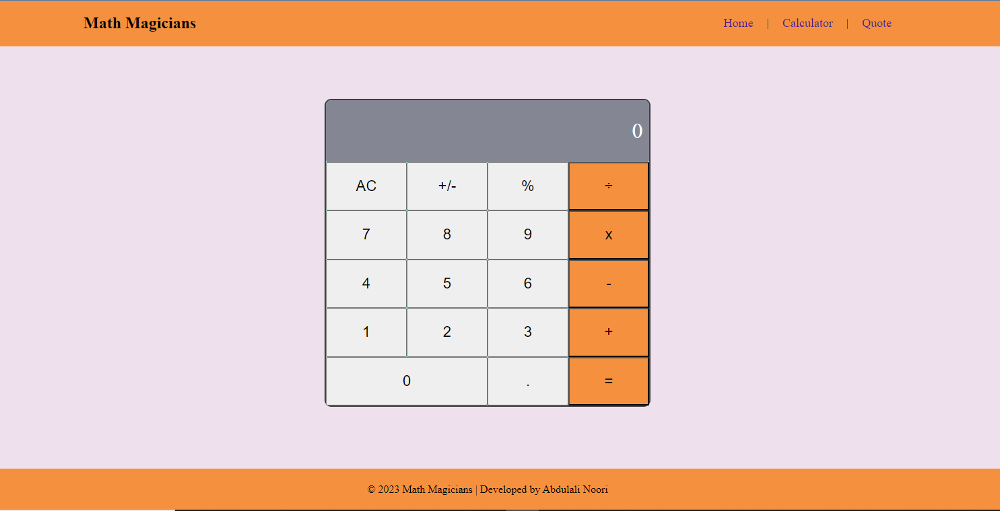
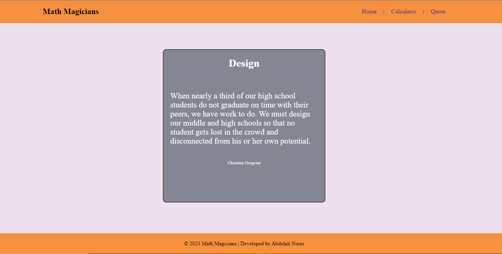

<!-- Open pull request using the following structure

  ## Project title: subtitle

  ### 🌟Branch features:

  - i
  - ii
  - iii

  ### [ 🚀 Branch Demo](https://ab-noori.github.io/Project-Template/)

-->

> # Math Magicians

| Desktop Veiw Representation|
|---------------------------------------|
|

|
|

|
|

|

<!-- TABLE OF CONTENTS -->

# 📗 Table of Contents

- [📖 About the Project](#about-project)
  - [🛠 Built With](#built-with)
    - [Tech Stack](#tech-stack)
    - [Key Features](#key-features)
  - [🚀 Live Demo](#live-demo)
- [💻 Getting Started](#getting-started)
  - [Setup](#setup)
  - [Prerequisites](#prerequisites)
  - [Install](#install)
  - [Usage](#usage)
  - [Run tests](#run-tests)
  - [Deployment](#triangular_flag_on_post-deployment)
- [👥 Authors](#authors)
- [🔭 Future Features](#future-features)
- [🤝 Contributing](#contributing)
- [⭐️ Show your support](#support)
- [🙏 Acknowledgements](#acknowledgements)
- [❓ FAQ (OPTIONAL)](#faq)
- [📝 License](#license)

<!-- PROJECT DESCRIPTION -->

# 📖 [Math Magicians] 

> **[Math Magicians]** is a website for mathematics fans. It is a Single Page App (SPA) that allows users to make simple calculations and read a random design-related quote.

## 🛠 Built With 

### Tech Stack 
- 
Client

    <ul>
      <li><a href="https://reactjs.org/">HTML</a></li>
      <li><a href="https://reactjs.org/">CSS</a></li>
      <li><a href="https://reactjs.org/">JavaScript</a></li>
      <li><a href="https://reactjs.org/">ReactJS</a></li>
      <li><a href="https://reactjs.org/">API</a></li>
    </ul>

### Key Features 

- **[Responsive layout]**
- **[UX/UI accessibility]**
- **[Dynamic data]**

(<a href="#readme-top">back to top</a>)

<!-- LIVE DEMO -->

## 🚀 Live Demo 

> - [Live Demo on Render](https://math-magicians-ab.onrender.com)
> - [Live Demo on Gh-pages](https://ab-noori.github.io/math-magicians/)

(<a href="#readme-top">back to top</a>)

<!-- GETTING STARTED -->

## 💻 Getting Started 

To get a local copy up and running, follow these steps:

### Prerequisites

In order to run this project you need:
  - A browser of you choice.
  - A text editor of your choice.
  - An installed node.js on your local system

### Setup

Clone this repository to your desired folder:

- Use the following Commands:

      cd your-desired-folder
      git clone git@github.com:ab-noori/math-magicians.git

### Install
- Install this project with:

       npx create-react-app my-app
       cd my-app
       npm start

### Usage
- Use following commands to run on your local system:

      npm run build
      npm run deploy

### Run tests
- Run the following script and style test:

      npx eslint "**/*.{js,jsx}"
      npx eslint "**/*.{js,jsx}" --fix

      npx stylelint "**/*.{css,scss}"
      npx stylelint "**/*.{css,scss}" --fix
 

### Deployment
- You can deploy this project using:

      npm run build
      gh-pages -d build

(<a href="#readme-top">back to top</a>)

## 👥 Authors 

👤 **Abdul Ali Noori**

- GitHub: [@ab-noori](https://github.com/ab-noori)
- Twitter: [@AbdulAliNoori4](https://twitter.com/AbdulAliNoori4)
- LinkedIn: [abdul-ali-noori](https://www.linkedin.com/in/abdul-ali-noori-384b85195/)

## 🔭 Future Features 

- [ ] **[Add About page]**
- [ ] **[Add Contact page]**

(<a href="#readme-top">back to top</a>)

## 🤠Contributing 

Contributions, issues, and feature requests are welcome!

Feel free to check the [issues page](https://github.com/ab-noori/math-magicians/issues).

(<a href="#readme-top">back to top</a>)

## ⭐️ Show your support 

 
  If you like this project, give it a star.

(<a href="#readme-top">back to top</a>)

## 🙠Acknowledgments 

  I would like to thank Microverse and my coding partners, and a Micronaut, Miss [`Kanza Tahreem`](https://github.com/KanzaTahreem), she has done amazing projects, I inspired from her project for this project. also I want to give credit to [`Nerd's lesson`](https://www.youtube.com/@Nerdslesson)
YouTub Channel, it's [`react tutorial`](https://www.youtube.com/watch?v=cd3P3yXyx30) is really helpfull.

(<a href="#readme-top">back to top</a>)

## ❓ FAQ (OPTIONAL) 

- **How to make it mobile friendly?**

  - Put a viewport tag in the header

- **How to design the site?**

  - Draw a mockup before start to code

(<a href="#readme-top">back to top</a>)

## 📠License 

This project is [MIT](./LICENSE) licensed.

(<a href="#readme-top">back to top</a>)

